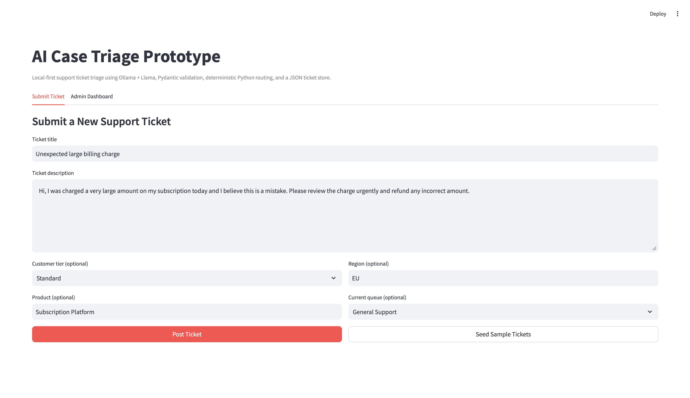
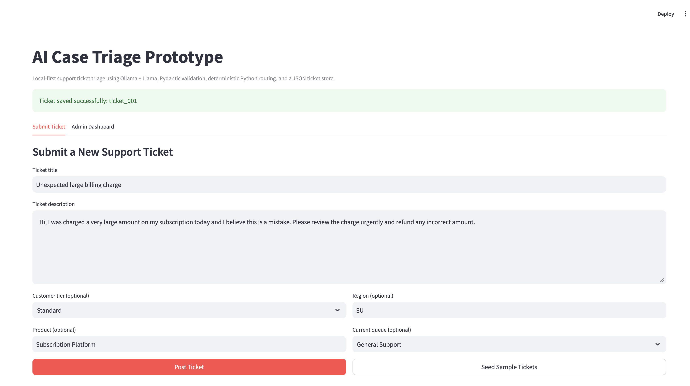
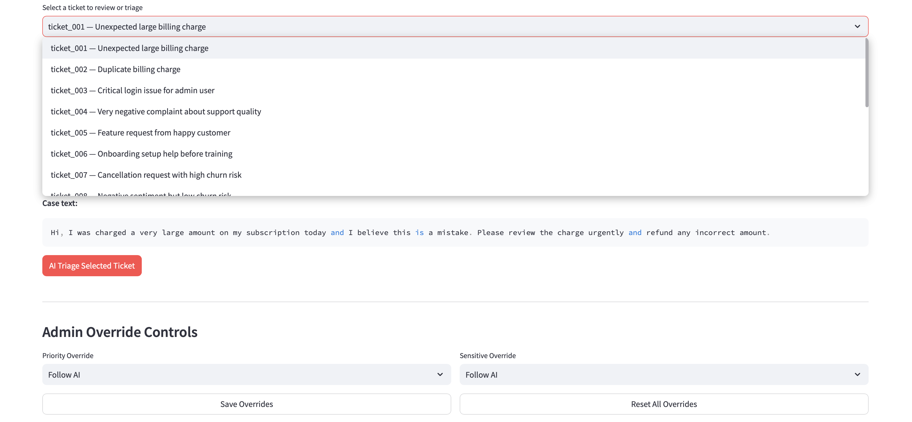
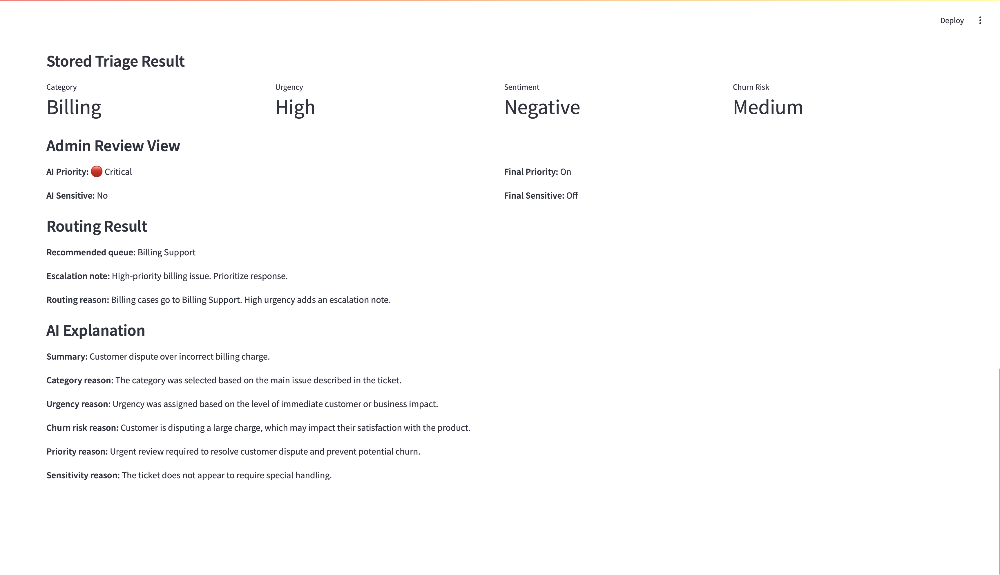
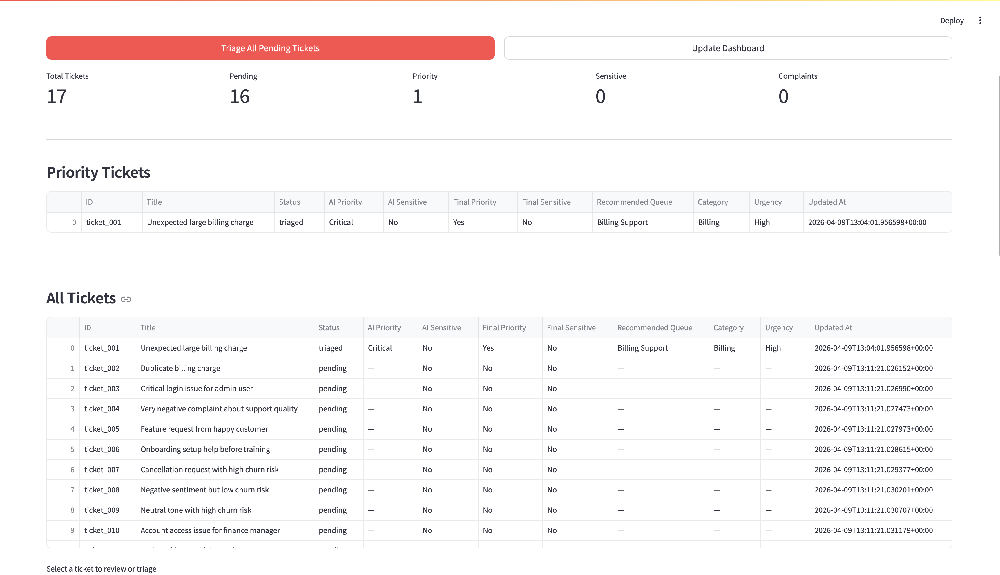
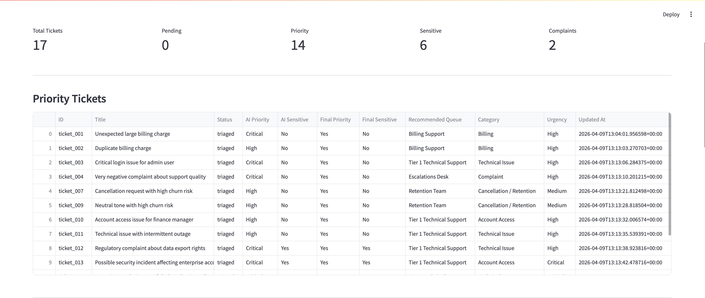
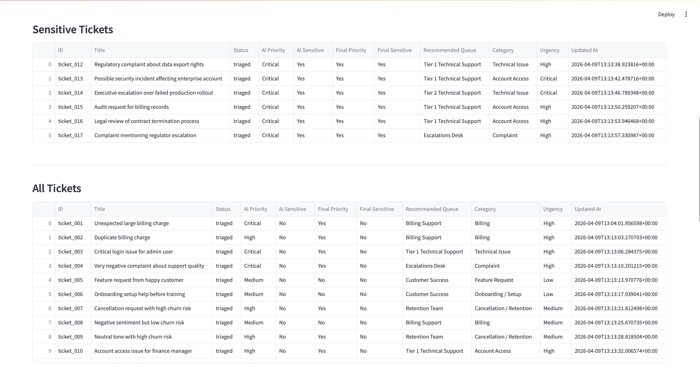

# AI Case Triage & Prioritization Prototype

A local AI support-operations prototype that reads support tickets, classifies them, estimates urgency, sentiment, churn risk, recommends the right support queue, and helps admins identify the most important and sensitive cases for review.

This project was built as an MVP portfolio project to demonstrate how AI can create business value in support workflows.

## Why this project matters

Support teams do not only need a chatbot. They need help with:

- understanding incoming cases quickly
- prioritizing the right tickets first
- routing cases to the correct queue
- surfacing high-risk and sensitive situations
- keeping humans in control of final operational decisions

## What the app does

### User side
- submit a new support ticket
- optionally include customer tier, product, region, and current queue

### AI triage
- classify ticket category
- predict urgency
- predict sentiment
- predict churn risk
- recommend an admin priority level
- detect whether the case appears sensitive
- generate explanation fields for each decision
- validate all model output with Pydantic

### Routing
- use Python rules to recommend the correct queue
- add escalation notes where needed

### Admin dashboard
- view all tickets
- see priority tickets first
- see sensitive tickets first
- triage one ticket
- triage all pending tickets in batch
- review AI priority and sensitivity recommendations
- override final priority and sensitivity flags when needed

## Key features

- local LLM integration with Ollama
- structured JSON output from the model
- Pydantic validation for reliability
- Routing rules in Python
- local JSON ticket store
- batch triage for pending tickets
- admin override workflow
- dashboard sections for priority and sensitive tickets
- no paid APIs

## Tech stack

- Python
- Streamlit
- Ollama
- local Llama model
- Pydantic
- pandas
- JSON file storage

## Project architecture

The app is designed with a clear separation of responsibilities:

### `schema.py`
Defines the exact shape of the AI output using Pydantic.

### `llm_service.py`
Builds the prompt, calls Ollama, parses model output, normalizes small issues, retries once if needed, and validates the final response.

### `routing.py`
Applies business rules to choose the recommended support queue.

### `ticket_manager.py`
Handles ticket in the local JSON store.

### `admin_rules.py`
Computes admin-facing logic such as:
- priority tickets
- sensitive tickets
- final priority/sensitivity flags
- batch triage of pending tickets

### `ui_helper.py`
Contains reusable dashboard rendering helpers.

### `app.py`
Orchestrates the Streamlit UI and connects all pieces together.

## Folder structure

```text
.
├── app.py
├── data/
│   ├── reference_data.json
│   ├── sample_cases.json
│   └── tickets.json
├── src/
│   ├── core/
│   │   ├── config.py
│   │   ├── schema.py
│   │   └── utils.py
│   ├── services/
│   │   ├── admin_rules.py
│   │   ├── llm_service.py
│   │   ├── routing.py
│   │   └── seed.py
│   ├── storage/
│   │   └── ticket_manager.py
│   └── ui/
│       └── ui_helper.py
└── README.md
```

## How the system works

### 1. Ticket submission
A user submits a ticket through the Streamlit app. There is a seed option availabe to add tickets to the system in batch.

### 2. AI analysis
The ticket is sent to Ollama with a structured prompt.

The model returns:
- category
- urgency
- sentiment
- churn risk
- priority level
- sensitivity flag
- explanation fields

### 3. Validation
The output is validated against the `CaseAnalysis` schema.

If the output is invalid:
- the service normalizes small gaps where possible
- retries once
- raises a clear error if still invalid

### 4. Routing
Python routing rules decide:
- recommended queue
- optional escalation note
- routing explanation

### 5. Admin review
The admin dashboard then shows:
- AI priority
- AI sensitivity
- final priority
- final sensitivity

Admins can override the final flags while preserving the original AI recommendation.

## Priority and sensitivity logic

### AI recommendation
The model recommends:
- `priority_level`
- `is_sensitive`

### Final admin-visible state
The final dashboard state is computed from:
- AI recommendation
- admin override, if present

That means the system is:
- AI-assisted
- but not AI-only

Humans remain in control of the final flags.

## Batch triage

The admin dashboard includes a batch action:

**Triage All Pending Tickets**

This:
- finds all pending tickets
- runs the same triage pipeline for each ticket
- saves the results
- shows a notification summary

## Local setup

### 1. Clone the repository
```bash
git clone <https://github.com/Arshia-Hosseini/AICaseTriagePrototype.git>
cd <your-repo-folder>
```

### 2. Create and activate a virtual environment
```bash
python -m venv .venv
source .venv/bin/activate
```

On Windows:
```bash
.venv\\Scripts\\activate
```

### 3. Install dependencies
```bash
pip install -r requirements.txt
```

### 4. Install and run Ollama
Make sure Ollama is installed and running locally.

Then pull The model, for example:
```bash
ollama pull llama3.1:8b
```

## Run the app

```bash
streamlit run app.py
```

## Sample workflow

### Manual flow
1. Submit a new ticket
2. Open the Admin Dashboard
3. Select the ticket
4. Click **AI Triage Selected Ticket**
5. Review the recommended queue and explanations
6. Optionally override final priority or sensitivity

### Batch flow
1. Seed sample tickets
2. Open the Admin Dashboard
3. Click **Triage All Pending Tickets**
4. Refresh the dashboard
5. Review priority and sensitive sections

## Sample ticket types included

The project includes sample cases covering:
- billing issues
- technical incidents
- complaints
- onboarding/setup
- cancellation and retention risk
- finance/account access
- enterprise production impact
- regulatory / compliance / legal language
- security-related concerns
- executive escalation

## Screenshots
### Submit Ticket
Shows the user-side ticket submission form before posting a new ticket.



### Ticket Posted Successfully
Shows the confirmation message after a new ticket is submitted.



### Select A Ticket
Shows admin can select a ticket from the ticket list.



### Single Ticket Triage
Shows one selected ticket after AI triage, including the ticket details, AI analysis, routing result.



### Tickets overview table
Shows the ticket overview table before batch triage.



### Tickets batch triage
Shows the tickets overview table after batch triage.





## Future improvements

Possible next steps:
- user-side follow-up updates with automatic re-triage
- ticket history over time
- dedicated VIP / regulator handling rules
- richer dashboard UI and filtering
- stronger sensitivity rules
- Docker packaging
- database-backed storage